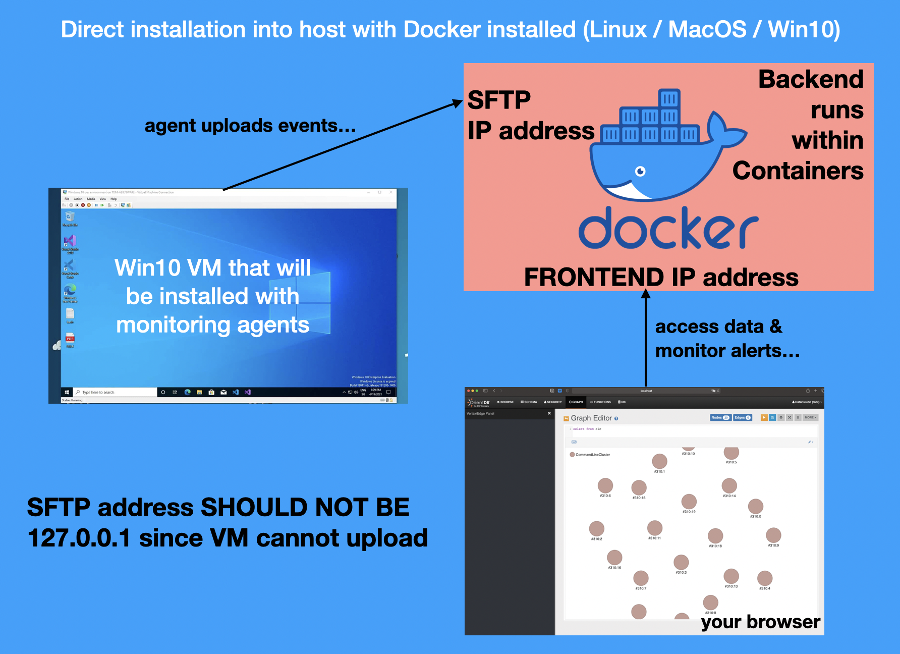

# Demo
Click thumbnail below to watch:

[](https://www.youtube.com/watch?v=5YeH1RwzqXU)

# Getting Started



If you install backend **within a separate Linux VM**, **please ensure the Win 10 VM is using a network that can reach the backend VM**.

## Overview

You can install OpenEDR backend on **directly on** **Linux, MacOS (need a sudoer account**) or Windows Pro (or beyond) with **docker installed**, or within a Ubuntu/Debian **V**irtual **M**achine (please install latest Docker within the VM) with the following specs: 

* 1 vCPU, 4GB RAM & 50GB disk (note that Ubuntu 20 has wonky DNS that may affect installation).
* Host agents tested on Win10 & Server 2012R2 to 2019 64bit (we monitor these 'endpoints')
* Windows endpoints needs to reach backend TCP port 2222 & 8888 (check for any firewall in-between)

## Installation Steps
**For Linux & MacOS**, start a shell session & run the following (**DO NOT preceed** with `sudo`):

`curl -L https://github.com/jymcheong/OpenEDR/tarball/master | tar xz && mv jym* openEDR && cd openEDR && ./install.sh`

*For **Windows Pro+ with [WSL2 & Docker installed](https://docs.docker.com/desktop/windows/wsl/)***, start a Powershell session, copy & run the following:

`$tmp = New-TemporaryFile | Rename-Item -NewName { $_ -replace 'tmp$', 'zip' } -PassThru; Invoke-WebRequest -OutFile $tmp https://github.com/jymcheong/OpenEDR/zipball/master; $tmp | Expand-Archive -DestinationPath .\ ; Move-Item jym* openedr ; $tmp | Remove-Item; cd openedr; get-content -raw .\install.ps1 | iex` 

### Select IP Addresses for SFTP Receiver & Monitoring Frontends

The installation script *will prompt you to select addresses* for the two stated purposes. 

- Windows endpoints host-agents will upload events to the SFTP Receiver via that selected IP
- To access OrientDB & Alert monitoring web interfaces, select an address *preferably from a different interface* from the SFTP Receiver.
- You may choose the SAME IP (not 127.0.0.1) for testing or exploration.

Kudos to [YJ's contribution for this enhancement](https://www.notion.so/jymcheong/Prompt-IP-address-selection-during-backend-installation-b1d21b69cc3c4e3aad98802f0a71ba1d).

### Testing Connection between Windows Endpoint -> Backend

Simply visit:

```
http://<YOUR_SFTP_RECEIVER_IP>:8888/
```

**If the page does not load, it means there's some connectivity issues to resolve.** Otherwise you will see Powershell commands for installing host agents, similar to the following (within the bigger red box,  **Copy everything.**):


### Installing host agents on Windows Endpoints

**Paste into an admin powershell session to run those commands**. **You should REBOOT the Windows endpoint before proceeding...**

Go **your backend** (NOT the Windows endpoint), use `docker logs -f orientdb` & you should see something like this:


- This is the log console of OrientDB where all the events are stored
- It is useful for **single** endpoint exploration, for instance as a pen-tester, you can see in real-time what kind of process sequences related to your payload or technique.
- As a student, you can see the repeated patterns whenever Windows reboot or you fired up typical apps like Browser, MS-Office & so on...

## Run a Quick Test!

https://github.com/jymcheong/OpenEDR/wiki/3.-Detection-&-False-Positives

## Other installation scenarios

https://github.com/jymcheong/OpenEDR/wiki/0.-Installation

# Shout-Outs

To Microsoft for Sysmon, Nxlog for Nxlog-CE, OrientDB & Wekan!
